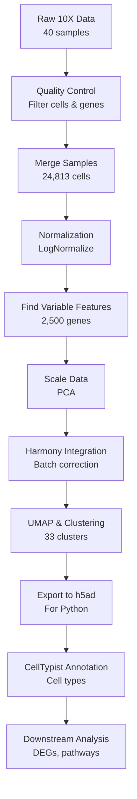

# Single-Cell RNA-seq Analysis of Type 1 Diabetes Pancreatic Islets

[](https://www.ncbi.nlm.nih.gov/geo/query/acc.cgi?acc=GSE279086)
[](https://www.r-project.org/)
[](https://www.python.org/)
[](https://satijalab.org/seurat/)

## 📋 Overview

This repository contains a comprehensive single-cell RNA-seq analysis pipeline for investigating pancreatic islet cells in Type 1 Diabetes (T1D) patients compared to healthy controls. The analysis includes data preprocessing, quality control, batch correction using Harmony, clustering, and cell type annotation using CellTypist.

**Dataset:** GSE279086  
**Technology:** 10X Genomics scRNA-seq  
**Samples:** 40 samples (12 HC + 28 T1D)  
**Total Cells:** 24,813 cells  
**Genes:** 28,317 genes

---

## 🎯 Project Objectives

1. Process and quality control raw 10X Genomics data
2. Integrate multiple samples using Harmony batch correction
3. Identify cell populations through clustering
4. Annotate cell types using CellTypist
5. Compare cellular composition between HC and T1D conditions
6. Identify disease-associated gene expression patterns

---

## 📁 Repository Structure

```
GSE279086-T1D-scRNAseq/
│
├── README.md                          # This file
├── LICENSE                            # MIT License
│
├── scripts/                           # Analysis scripts
│   ├── 01_data_preparation.Rmd        # 10X to Seurat conversion, QC
│   ├── 02_integration_harmony.Rmd     # Harmony integration & clustering
│   └── 03_celltypist_annotation.ipynb # Cell type annotation in Python
│
├── data/                              # Data files (gitignored)
│   ├── raw/                           # Raw 10X data (not tracked)
│   └── metadata/                      # Sample metadata
│       └── GSE279086_metadata.csv
│
├── outputs/                           # Analysis outputs
│   ├── rds/                           # Seurat objects
│   │   ├── 02_seurat_merged.rds
│   │   ├── 03_seurat_pca_umap_JOINED.rds
│   │   └── 04_harmony_integrated.rds
│   │
│   ├── h5ad/                          # Python-compatible files
│   │   └── 04_harmony_integrated.h5ad
│   │
│   └── tables/                        # Summary tables
│       ├── 01_sample_summary.csv
│       ├── qc_metrics.csv
│       └── pca_variance.csv
│
├── plots/                             # Figures and visualizations
│   ├── qc/                            # Quality control plots
│   │   ├── cells_per_sample.png
│   │   └── qc_violin_plots.png
│   │
│   ├── integration/                   # Harmony integration results
│   │   ├── elbow_plot.png
│   │   └── harmony_comparison.png
│   │
│   └── annotation/                    # Cell type annotation
│       └── celltypist_umap.png
│
├── environment/                       # Reproducibility files
│   ├── R_sessionInfo.txt
│   ├── requirements.txt               # Python packages
│   └── conda_environment.yml
│
└── docs/                              # Documentation
    ├── methods.md                     # Detailed methods
    └── file_descriptions.md           # File descriptions
```

---

## 🔧 Installation & Setup

### R Environment

```r
# Install required R packages
install.packages("Seurat")
install.packages("harmony")
install.packages("dplyr")
install.packages("ggplot2")
install.packages("patchwork")

# Install Bioconductor packages
if (!requireNamespace("BiocManager", quietly = TRUE))
    install.packages("BiocManager")

BiocManager::install("SingleCellExperiment")
BiocManager::install("zellkonverter")
```

### Python Environment

```bash
# Create conda environment
conda create -n scrna python=3.8
conda activate scrna

# Install packages
pip install scanpy
pip install celltypist
pip install anndata
pip install matplotlib
pip install seaborn
```

---

## 🚀 Quick Start

### 1. Data Preparation

```r
# Run the data preparation script
rmarkdown::render("scripts/01_data_preparation.Rmd")
```

This script:
- Loads raw 10X data from 40 samples
- Creates Seurat objects with QC metrics
- Merges samples
- Adds metadata (HC vs T1D conditions)

### 2. Harmony Integration

```r
# Run Harmony integration
rmarkdown::render("scripts/02_integration_harmony.Rmd")
```

This script:
- Normalizes and scales data
- Performs PCA
- Runs Harmony batch correction
- Performs clustering (33 clusters identified)
- Generates UMAP visualizations

### 3. Cell Type Annotation

```bash
# Run CellTypist annotation in Python
jupyter notebook scripts/03_celltypist_annotation.ipynb
```

This notebook:
- Loads Harmony-integrated h5ad file
- Runs CellTypist with immune cell models
- Assigns cell type labels
- Visualizes results

---

## 📊 Key Results

### Sample Distribution
- **Healthy Controls (HC):** 5,836 cells (23.5%)
- **Type 1 Diabetes (T1D):** 18,977 cells (76.5%)

### Quality Metrics
- **Mean genes/cell:** ~2,000
- **Mean UMIs/cell:** ~8,000
- **Mitochondrial %:** <10% (after filtering)

### Clustering
- **Pre-integration:** 33 clusters (PCA-based)
- **Post-Harmony:** Batch effects reduced
- **Cell types identified:** [To be added after CellTypist annotation]

---

## 📈 Workflow Overview



---

## 📝 Methods Summary

### Quality Control
- **Filters applied:**
  - Genes detected in ≥3 cells
  - Cells with ≥200 features
  - Mitochondrial content < 20%
  - Ribosomal content calculated

### Normalization
- **Method:** LogNormalize (Seurat)
- **Scale factor:** 10,000
- **Variable features:** 2,500 genes (vst method)

### Batch Correction
- **Method:** Harmony
- **Batch variable:** Sample ID (orig.ident)
- **PCs used:** 1-50
- **Max iterations:** 20

### Clustering
- **Method:** Louvain algorithm (Seurat)
- **Resolution:** 0.8
- **Reduction:** Harmony
- **Dimensions:** 1-50

### Cell Type Annotation
- **Tool:** CellTypist
- **Model:** Immune_All_Low.pkl
- **Majority voting:** Enabled

---

## 📂 Important Files to Keep

### Essential RDS Files
1. **`02_seurat_merged.rds`** (424.8 MB)
   - Merged object with all metadata
   - Use for re-running analyses from merged state

2. **`03_seurat_pca_umap_JOINED.rds`** (5 GB)
   - Normalized, PCA, UMAP, pre-Harmony
   - Use for comparing pre/post Harmony

3. **`04_harmony_integrated.rds`** (TBD)
   - Final Harmony-integrated object
   - **PRIMARY FILE for downstream analysis**

### H5AD File
1. **`04_harmony_integrated.h5ad`** (534.218 KB)
   - For Python/CellTypist
   - Compressed, no scale.data

### Metadata Files
1. **`GSE279086_metadata_full.csv`** (57.3 KB)
   - Complete sample metadata with conditions

### Plots Directory
- Keep all plots organized by analysis stage

---

## 🗑️ Files to Delete

### Temporary/Intermediate Files
- ❌ `GSE279086_merged.rds` (101.9 MB) - Old version with layer issues
- ❌ `GSE279086_seurat_processed.rds` (5 GB) - Duplicate of another version
- ❌ `.Rhistory` - R command history
- ❌ Any `.h5seurat` files - Not needed if you have RDS + h5ad
- ❌ `seurat_filtered.rds` (103 MB) - Intermediate QC file
- ❌ `seurat_normalized.rds` (5 GB) - Intermediate normalization file
- ❌ `seurat_with_conditions.rds` (424.8 MB) - Duplicate metadata version

### Summary Files to Keep
- ✅ `01_sample_summary.csv`
- ✅ `pca_variance.csv`
- ✅ `qc_filtering_summary.csv`
- ✅ `GSE279086_QC_metrics.csv`

---

## 🔬 Citation

If you use this analysis pipeline, please cite:

```
[Your Name]. (2026). Single-Cell RNA-seq Analysis of Type 1 Diabetes 
Pancreatic Islets (GSE279086). GitHub repository: 
https://github.com/[your-username]/GSE279086-T1D-scRNAseq
```

**Original Dataset:**
```
[Original Authors]. (Year). [Original Paper Title]. 
GEO Accession: GSE279086
```

---

## 📧 Contact

- **Author:** [Your Name]
- **Email:** [your.email@example.com]
- **LinkedIn:** [Your LinkedIn]
- **Portfolio:** [Your Portfolio Website]

---

## 📄 License

This project is licensed under the MIT License - see the [LICENSE](LICENSE) file for details.

---

## 🙏 Acknowledgments

- **Seurat** - Spatial analysis framework
- **Harmony** - Batch correction algorithm
- **CellTypist** - Automated cell type annotation
- **GEO** - Data repository (GSE279086)

---

## 📚 References

1. Hao et al. (2021). Integrated analysis of multimodal single-cell data. *Cell*
2. Korsunsky et al. (2019). Fast, sensitive and accurate integration. *Nature Methods*
3. Domínguez Conde et al. (2022). Cross-tissue immune cell analysis. *Science*

---

**Last Updated:** February 11, 2026  
**Status:** ✅ Active Development
